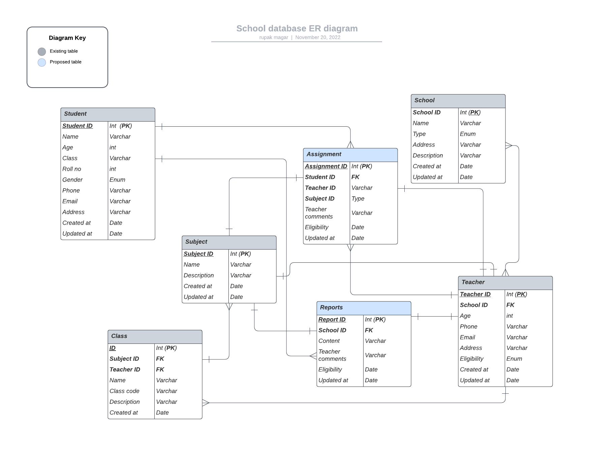

<p align="center">
  <a href="http://nestjs.com/" target="blank"></a>
</p>

[circleci-image]: https://img.shields.io/circleci/build/github/nestjs/nest/master?token=abc123def456
[circleci-url]: https://circleci.com/gh/nestjs/nest

  <p align="center">A progressive <a href="http://nodejs.org" target="_blank">Node.js</a> framework for building efficient and scalable server-side applications.</p>

  <!--[](https://opencollective.com/nest#backer)
  [](https://opencollective.com/nest#sponsor)-->

## Description

[Nest](https://github.com/nestjs/nest) framework TypeScript starter repository. Simple School Management System.

## Project Structure
```
src
├── authentication
├── common
│   ├── constants
│   ├── decorators
│   │   ├── metadata
│   │   └── requests
│   ├── exceptions
│   ├── guards
│   ├── helpers
│   │   ├── exceptions
│   │   └── responses
│   ├── interfaces
│   ├── middlewares
│   │   └── models
│   ├── pipes
│   ├── serializers
│   │   ├── exceptions
│   │   └── responses
│   └── validations
├── config
│   ├── api
│   ├── app
│   ├── cache
│   ├── database
│   │   └── postgres
│   ├── queue
│   ├── session
│   └── storage
├── database
│   ├── factories
│   │   ├── addresses
│   │   └── users
│   ├── migrations
│   └── seeders
│       ├── addresses
│       └── users
├── jobs
│   ├── consumers
│   │   └── verification-mail
│   └── producers
│       └── verification-mail
├── mails
│   └── verification
├── models
│   ├── addresses
│   │   ├── constants
│   │   ├── entities
│   │   ├── interfaces
│   │   └── serializers
│   └── users
│       ├── constants
│       ├── entities
│       ├── interfaces
│       └── serializers
├── providers
|   ├── cache
│   │   └── redis
│   ├── database
│   │   └── postgres
│   └── queue
│       └── redis
├── app.controller.ts
├── app.module.ts
├── app.service.ts
├── main.ts
└── seed.ts
```

## Installation

```bash
$ npm install
```

## Running the app

```bash
# development
$ npm run start

# watch mode
$ npm run start:dev

# production mode
$ npm run start:prod
```

## Test

```bash
# unit tests
$ npm run test

# e2e tests
$ npm run test:e2e

# test coverage
$ npm run test:cov
```
## ER Diagram

<p align="center">

</p>


## Support

Nest is an MIT-licensed open source project. It can grow thanks to the sponsors and support by the amazing backers. If you'd like to join them, please [read more here](https://docs.nestjs.com/support).

## Stay in touch

- Author - [Rupak Thapa Magar](https://www.linkedin.com/in/rupak-thapa-magar-9a5488171/)
- Website - [http://tmr.com.np/](http://tmr.com.np/)

## License

Nest is [MIT licensed](LICENSE).
# Nestjs
